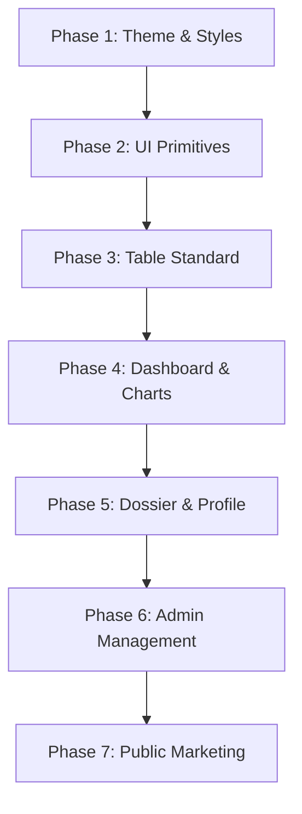

# UI REFACTOR PLAN
**Econ-IQ Frontend Refactoring Implementation Roadmap**

---

## 1. OBJECTIVE & SCOPE

Migrate the Econ-IQ frontend client from a collection of inconsistent views to a consolidated, enterprise-grade operating system. This plan details the code changes required, step by step, to eliminate styling drift, consolidate redundant components, and verify API compliance.

---

## 2. REFACTORING ROADMAP

### Phase 1: Theme & Global Styles (`globals.css` & `client-layout.tsx`)
1.  **Refactor `globals.css`**: Remove the `.dark` selector overrides that cause page theme conflicts. Ensure all colors (both public and internal dashboard) resolve from the primary `:root` variables.
2.  **Consolidate Class References**: Audit tailwind styles to replace hardcoded hex tags (e.g. `bg-[#FAF9F6]`) with variable class names (e.g. `bg-background`).
3.  **Adjust `ClientLayout`**: Clean up theme-loading side-effects. Remove references to toggling dark themes. Ensure the viewport margin styles are standardized (`p-md md:p-lg lg:p-xl`).

### Phase 2: Primitive Elements Standardization (`src/components/ui/`)
1.  **Button**: Standardize styles to utilize the unified tailwind theme variables (`bg-primary`, `bg-brand-accent`).
2.  **Input & Select**: Standardize sizes to a uniform `h-10`. Unify labeling typography to a bold `caption` style. Ensure error states follow the visual hierarchy standards.
3.  **Badge**: Define consistent colors for segment states (`Active` -> `accent`, `Monitor` -> `warning`, `Liquidity Stress` -> `danger`).
4.  **Card**: Ensure `CardHeader` and `CardFooter` use the unified `border-outline-variant/60` borders.

### Phase 3: Bloomberg-Grade Table Implementation (`Table.tsx`)
Rebuild `src/components/ui/Table.tsx` to support professional data-grid mechanics:
1.  **Sticky Headers**: Apply `sticky top-0 bg-surface z-10` to the table head container.
2.  **Sticky First Column**: Pin the primary data columns (e.g. Customer Name) with `sticky left-0 bg-surface z-10` classes.
3.  **Loading Skeleton**: Render a table skeleton row template (`bg-outline-variant/30 animate-pulse`) when `isLoading` is active.
4.  **Density Toggles**: Implement standard margins (`density="standard"`) and high-density margins (`density="compact"`) to maximize data visibility.

### Phase 4: Executive Dashboard Redesign (`/dashboard`)
1.  **KPI Cards**: Rebuild cards to clearly display comparison metrics and health deltas.
2.  **Commercial Pulse Chart**: Wrap coordinates mapping in a custom hook to calculate SVG path values. Replace all hardcoded colors within the SVG canvas with tailwind stroke variables.
3.  **State spreads**: Map state values cleanly using token-compliant progress indicators.
4.  **Attention Queues**: Replace all three inline list templates with the redesigned `Table` component, enabling instant sorting and filtering.

### Phase 5: Credit Dossier profile Redesign (`/customer/[id]`)
Transform the CRM-style customer profile into a comprehensive credit intelligence dossier:
1.  **Dossier Ribbon**: Redesign headers to present key identifiers (Account ID, city, last purchase timestamps) in a structured metadata block.
2.  **8 Score Blocks**: Group metrics into two distinct zones: **Core Intelligence** (Health, Risk, Growth, Trust) and **Supporting Indicators** (Opportunity, Credit, Collection, Relationship).
3.  **4 SVG Timelines**: Consolidate the duplicate SVG path code into a shared component helper. Unify tooltip, axis line, and guide styles.
4.  **Action recommendations**: Style the Next-Best-Action queue with distinct priority indicators.

### Phase 6: Admin Management & Exporter Refactoring (`/users`, `/api-keys`, `/reports`)
1.  **Analyst Directory**: Replace the inline analyst directory card rows with the standard `Table` component. Add user role controls for SUPER_ADMIN sessions.
2.  **Developer Key Console**: Rebuild the registered keys list using the standardized Table component. Mask raw developer keys upon generation, displaying only truncated prefixes.
3.  **Intelligence Exporter**: Add a "Recent Exports" table to `/reports` using the Table primitive, documenting export dates, target segments, and checksum values.

### Phase 7: Public Marketing Pages (`/`, `/platform`, `/solutions`, `/about`, etc.)
1.  **Theme Alignment**: Audit public routes (`page.tsx`, `platform/page.tsx`, `solutions/page.tsx`, etc.) to remove hardcoded hex values. Align layouts with the light premium corporate theme.
2.  **Call to Action (CTA)**: Standardize all headers, footers, and marketing buttons to consume the primitive `Button` component.
3.  **Layout margins**: Ensure all public sections use standard containers (`max-w-[1280px] mx-auto px-6 lg:px-8`).

---

## 3. VERIFICATION & SUCCESS CRITERIA

*   **100% clean Next.js compilation**: The application compiles cleanly.
*   **0% hardcoded colors**: A global check for hex strings in JSX files returns zero occurrences.
*   **Unified Component Usage**: Inlined table elements (`<table>`, `<th>`, `<td>`) are replaced with `<Table />`.
*   **Seamless API binding**: All UI controls trigger corresponding queries on backend databases.
