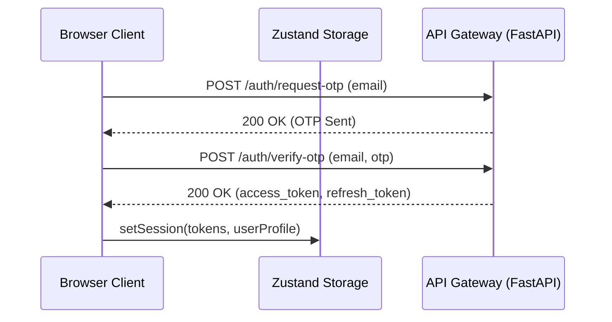

# Project Context (Single Source of Truth)

This document serves as the absolute single source of truth for the **ECON-IQ Frontend Command Center**. It aggregates architectural constraints, authentication lifecycles, role permissions, design specifications, and API connectivity layouts.

---

## 1. Project Overview & Objectives

ECON-IQ is a stateful B2B credit analysis portal. It connects directly with the **Econiq Core** backend engine to process longitudinal ledger events and predict cash flows, repayment risks, and policy recommendations.

### Core Objectives:
- **Zero-Mock Policy**: 100% of telemetry data, lists, and forms bind to live FastAPI core routes.
- **Visual Sophistication**: Adheres to custom enterprise visual layouts featuring dark-mode backgrounds, color-coded segments, and interactive charts.
- **Enterprise Robustness**: Strict input validations, JWT token lifecycle management, RBAC access gates, and global runtime error boundaries.

---

## 2. Technical Stack

- **Core Framework**: Next.js 16 (App Router) with React 19.
- **Styling Preprocessor**: Tailwind CSS v4 compiler.
- **State Management**: Zustand v5 (for persistent auth sessions).
- **Server Cache & Sync**: React Query v5 (for data queries, caching, and background refetching).
- **Network Interface**: Axios client with interceptor middleware.

---

## 3. Authentication & JWT Session Lifecycle

The login flow utilizes email validation and OTP code verification:

### 3.1. Credentials Storage
- **Access Tokens**: Coded in-memory via Zustand state selectors.
- **Refresh Tokens**: Saved in browser local storage via Zustand persistence.

### 3.2. Silent Refresh Mechanism
On receiving a `401 Unauthorized` exception during an API call:
1. The Axios client intercepts the response and pauses the request queue.
2. It executes `POST /auth/refresh` sending the refresh token.
3. If successful, it caches the new access token and retries the paused requests.
4. If the refresh request itself returns 401, the user's session is wiped (`clearSession()`), and the client redirects to `/login`.

---

## 4. Role & Permission Hierarchy

The system defines three logical roles (mapped to `SUPER_ADMIN` and `ANALYST` in code):

| Role Name | Scope Privileges | Restricted Actions |
| :--- | :--- | :--- |
| **Super Admin** | Full access to visual scorecards, user directory, and API keys. | None. |
| **Admin** | Full access to telemetry analytics and user directory. | Cannot provision other Super Admins. |
| **Analyst** | Read-only access to dashboard and customer matrices. | Blocked from provisioning users or generating developer API keys. |

*Note: UI elements (provision buttons, scopes selections) are hidden conditionally using check rules. Backend route validators enforce security at the database layer.*

---

## 5. Screen & Route Directory

| Route Path | View Context | API Queries Consumed | Access Gating |
| :--- | :--- | :--- | :--- |
| `/login` | Email & OTP verification | `/auth/request-otp`, `/auth/verify-otp` | Public |
| `/dashboard` | Bento KPIs, Pulse Chart, Aging & Segments | `/dashboard/*`, `/auth/me` | Authenticated |
| `/customers` | Server-side paged matrices | `/customers`, `/customers/export/csv` | Authenticated |
| `/customer/[id]` | Scorecard charts, drivers, forecasts | `/customer/{id}`, `/customer/{id}/*` | Authenticated |
| `/users` | Identity management | `/users` | Authenticated (Provisioning SUPER_ADMIN only) |
| `/api-keys` | Developer API credentials revoke | `/api-keys` | Authenticated (SUPER_ADMIN only) |
| `/settings` | System configurations | `/auth/me` | Authenticated |

---

## 6. Design & Aesthetic Guidelines

- **Typography**: Header layouts use Google Fonts *Outfit* (clean geometric sans-serif); text layouts use *Inter*.
- **Grid Layout**: Bento-box structural blocks.
- **Color tokens**:
  - Primary text: High-contrast off-whites and dark slates.
  - Accent color: Teal (`#0F766E`) for sales, growth, and actions.
  - Alert color: Red/Orange (`#ba1a1a`) for defaults, deterioration, and errors.
  - Warning color: Gold/Yellow (`#C8A96B`) for overdue alerts and risks.
